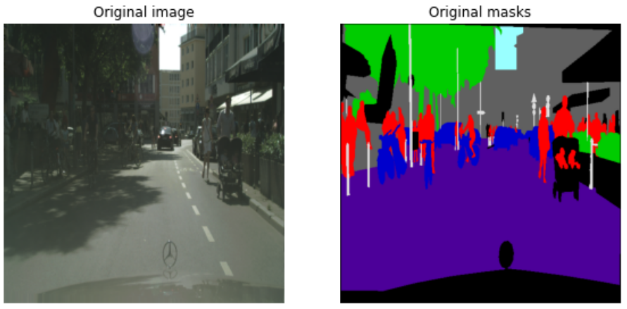
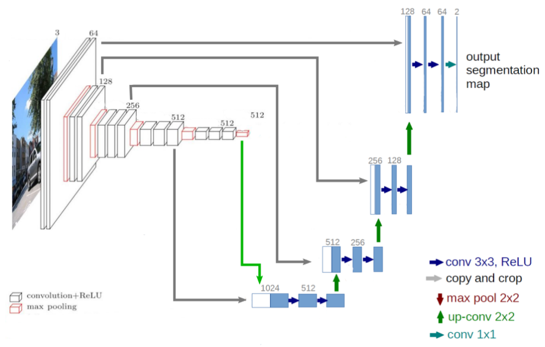

# Simple Taipy application for a semantic segmentation demonstrator

This example show how to set up a simple Taipy application to present the result of an semantic segmentation algorithm.

## Taipy application details

To be completed

## Semantic segmentation algorithm details

  
The algorithm use in this example is trained on the [Cityscapes Dataset](https://www.cityscapes-dataset.com/dataset-overview/) that represent urban street scene taken from a car point of view.

An example of data use for our model is presented below. The input data for the model are RGB images and the target data are semantic segmentation representation where each pixel of the image is labelled by a class id. The dataset contains 30 classes but we only use the 8 super classes in this case.

The model provided is a trained Unet configuration with a VGG16 encoder as represented below. This model doesn't present the best performance for this kind of task but is quite simple and light which is better for a demonstrator.

